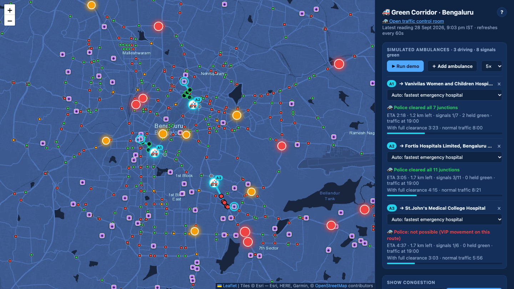
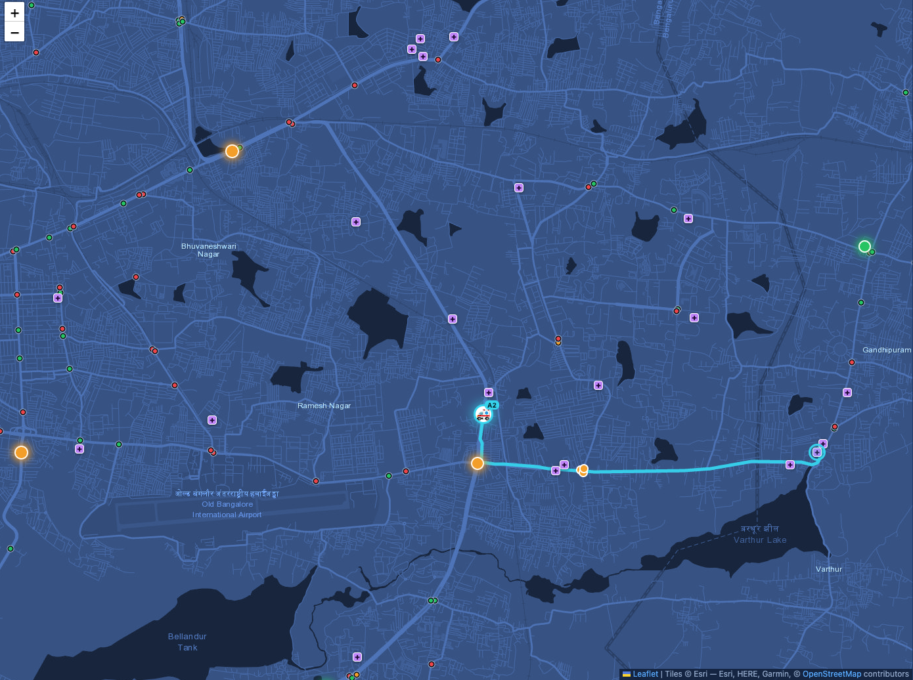
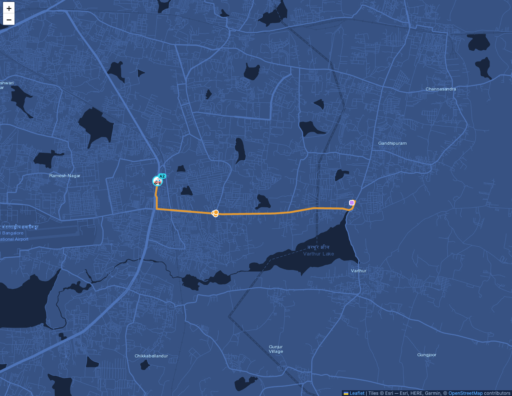
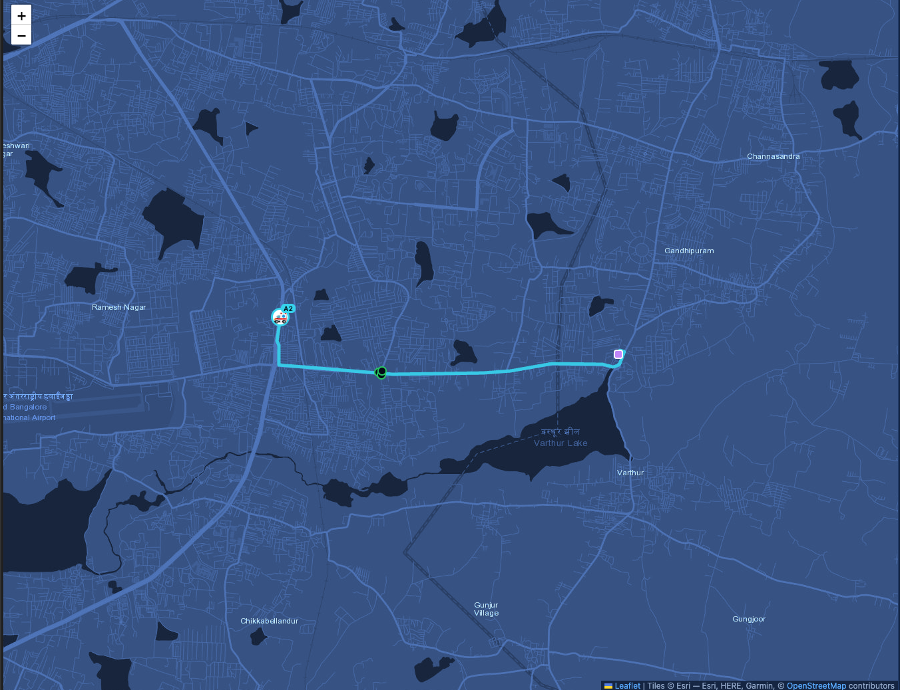
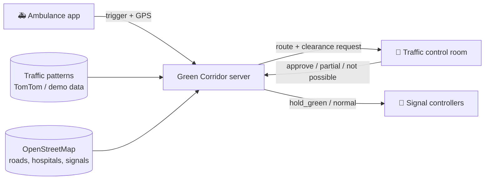

# 🚑 Green Corridor

**Clearing the way for ambulances in Bengaluru traffic.** An ambulance crew triggers an
emergency, the system finds the fastest route to hospital, traffic police approve it, and the
signals on the route turn green just before the ambulance reaches them.

A working simulation on Bengaluru's real road network, with its real hospitals and signal locations.


## The idea

In heavy traffic, an ambulance loses minutes at red lights and in queues. A **green corridor**
clears its route ahead of time. In Indian cities this is usually arranged by hand, with police
stationed at each junction. This project explores doing it with software:

1. **The ambulance crew triggers an emergency** from an app.
2. **The system plans the fastest route** to the best emergency hospital, using typical traffic
   for that time of day.
3. **Traffic police approve it** in a control room: the whole route, only some junctions, or
   "not possible". The ambulance never waits for the answer. It sets off at once and speeds up
   when clearance arrives.
4. **Cleared signals turn green** shortly before the ambulance arrives and return to normal
   after it passes.

## Features

- 🗺️ **Real map data:** Bengaluru's main road network, 1,097 hospitals (111 with emergency
  departments) and 611 signalised junctions, from OpenStreetMap
- 🚑 **Simulated ambulances:** add them anywhere, drag them to re-route, run several at once
- 🧭 **Traffic-aware routing:** picks the hospital that's fastest to reach, not the nearest, and
  compares the trip with and without a corridor
- 🚓 **Traffic control room:** approve, partly approve or decline requests; every decision is logged
- 🚦 **Signal priority:** approved signals are held green just ahead of the ambulance, with a
  per-signal command API that real signal hardware could poll
- 📈 **Traffic patterns:** congestion at 19 known bottlenecks by hour and weekday, from the
  TomTom Traffic API or built-in demo data

| Ambulance map | Traffic control room |
|---|---|
|  |  |

### One emergency, step by step

An ambulance near Marathahalli heads for a hospital near Varthur:

| 1. Ambulance sets off | 2. Request reaches the police | 3. Police clear the route |
|---|---|---|
|  |  |  |
| The crew triggers an emergency. The route is planned and the ambulance leaves at once, in normal traffic. | The control room sees the route in **amber**: waiting for a decision, which expires after 60 s. | Once approved, the route turns **cyan** and its junctions are marked cleared. They turn green just before the ambulance arrives. |

## Quick start

Needs Python 3.9 or newer.

```bash
git clone https://github.com/Pratyush1427/green-corridor.git
cd green-corridor
./run.sh
```

Open **<http://127.0.0.1:8000>** and click **▶ Run demo**. For the full experience, open the
**[traffic control room](http://127.0.0.1:8000/police)** in a second tab and answer the
requests yourself.

No API keys needed: the app generates realistic demo traffic data on first start.
With Docker: `docker build -t green-corridor . && docker run -p 8000:8000 green-corridor`

## How it works



- **Routing** runs Dijkstra's algorithm on a graph of 16.5k road junctions built from
  OpenStreetMap. Each road's travel time is its speed limit slowed by the typical congestion
  nearby at that hour.
- **Signal timing:** each approved signal is held green from 45 seconds before the
  ambulance's arrival until it passes, based on its live position along the route.
- **Safety by default:** unanswered requests expire after 60 seconds; ambulances that stop
  reporting are closed after 2 minutes, releasing their signals.

More in the **[detailed guide](docs/GUIDE.md)**: API reference, routing assumptions, collecting
real traffic data and refreshing the map data.

## Tech stack

**Backend:** Python, FastAPI, SQLite · **Frontend:** Leaflet, Chart.js, plain JavaScript (no
build step) · **Data:** OpenStreetMap (Overpass API), TomTom Traffic API, Esri map tiles

## Honest limits

This is a simulation, not a deployed system:
- **Simulated:** ambulances, signal timings, and (by default) traffic data. Roads, hospitals
  and signal locations are real.
- The time saved comes from a **simple model with made-up assumptions** (in `routing.py`), not
  measured trips.
- There's **no login yet**, and it isn't connected to real traffic signals. Doing that needs
  traffic police partnership.
- Not affiliated with the Bengaluru Traffic Police or any hospital.

## Roadmap

- [ ] Accounts: hospitals register ambulances; only traffic police can decide
- [ ] Ambulance phone app (a web page that sends real GPS)
- [ ] Hospital arrival screen: "incoming patient, ETA 6 min"
- [ ] Queue-clearing model: turn signals green early enough to drain the queue ahead
- [ ] Direction-aware signals: green only for the ambulance's approach
- [ ] Alerts to the officer at each junction on the route

## Credits

Map data © [OpenStreetMap](https://www.openstreetmap.org/copyright) contributors (ODbL) ·
Map tiles © Esri · Traffic data from [TomTom](https://developer.tomtom.com) ·
Built with [Leaflet](https://leafletjs.com) and [Chart.js](https://www.chartjs.org)

## License

[MIT](LICENSE)
