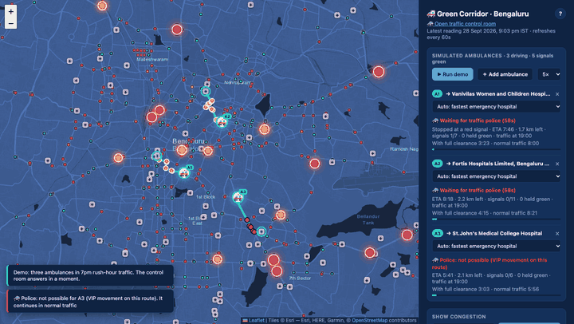
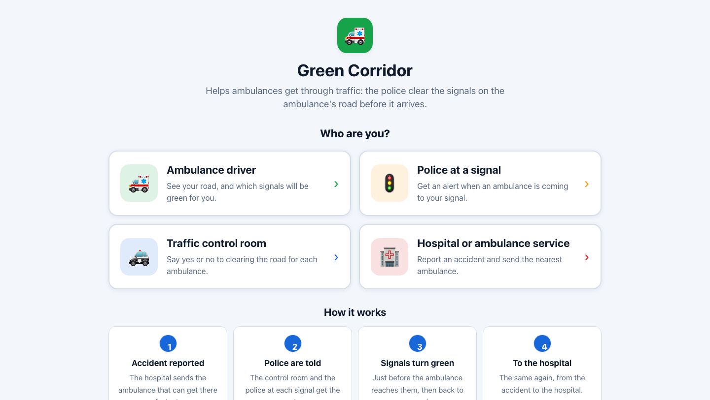
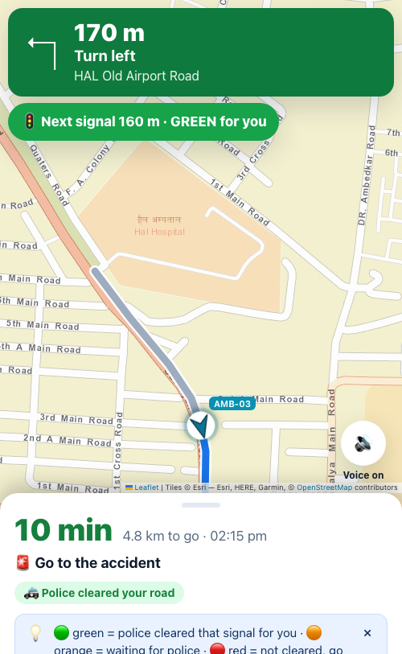
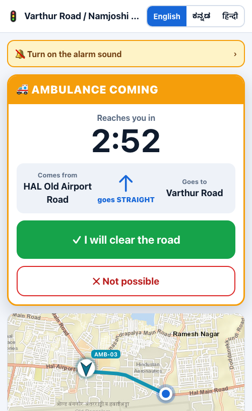
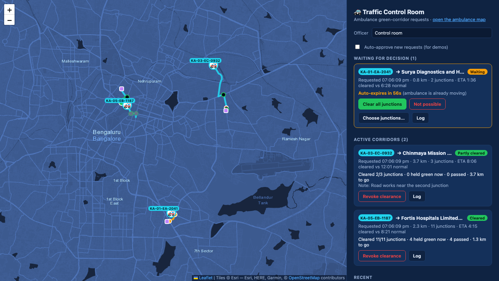
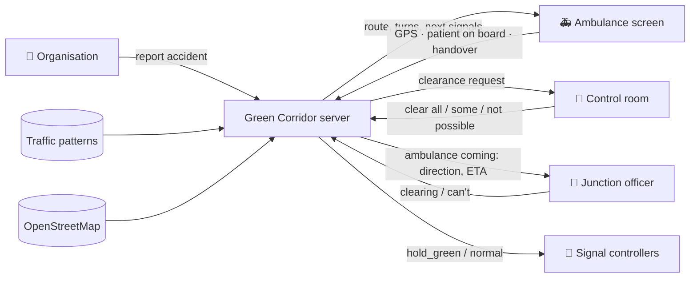

# 🚑 Green Corridor

**Clearing the way for ambulances in Bengaluru traffic.** An ambulance crew triggers an
emergency, the system finds the fastest route to hospital, traffic police approve it, and the
signals on the route turn green just before the ambulance reaches them.

A working simulation on Bengaluru's real road network, with its real hospitals and signal locations.

**▶ Try it live: [green-corridor-tt52.onrender.com](https://green-corridor-tt52.onrender.com)** ·
[presenter view](https://green-corridor-tt52.onrender.com/pitch)
<sub>(free hosting: the first visit after a quiet spell takes up to a minute to wake up)</sub>




## The idea

In heavy traffic, an ambulance loses minutes at red lights and in queues. A **green corridor**
clears its route ahead of time. In Indian cities this is usually arranged by hand, with police
stationed at each junction. This project explores doing it with software:

1. **An accident is reported.** The ambulance that can get there fastest is dispatched.
2. **The system plans the fastest route**, using typical traffic for that time of day: first to
   the **accident scene**, then with the patient on board to the best **emergency hospital**.
3. **Traffic police answer**: the control room clears the whole route, only some junctions, or
   says "not possible"; the **officer at each junction** can also answer for their own junction.
   The ambulance never waits for the answer. It sets off at once and speeds up when clearance arrives.
4. **Cleared signals turn green** shortly before the ambulance arrives and return to normal
   after it passes. The driver sees and hears which junctions are cleared.

## Four screens, made for first-time users

Open the app and pick who you are. Every screen uses plain words, big buttons and one clear
action at a time, and the colours always mean the same thing: **green** = go / cleared,
**orange** = waiting, **red** = stop / not cleared. The phone screens work in **English, ಕನ್ನಡ and हिन्दी**.

| Screen | For | What they do |
|---|---|---|
| **Hospital & ambulance service** `/dispatch` | Hospital or ambulance operator | Report an accident in two steps, see which ambulance goes before sending, follow every ambulance |
| **Ambulance** `/driver` | The driver, on a phone | Turn-by-turn directions, "Next signal 590 m · will turn green for you", one big button at the scene and at the hospital |
| **Police at a signal** `/junction` | The officer at a junction | Loud alert, countdown, where the ambulance comes from and goes, "I will clear the road" or "Not possible" |
| **Traffic control room** `/police` | Traffic control room | "AMB-03 needs a clear road": Yes, choose signals, or Not possible |
| **Presenter** `/pitch` | You, on stage | All of the above on one screen, with a narrated, repeatable 2-minute story |



| Ambulance (phone) | Junction officer (phone) | Traffic control room |
|:-:|:-:|:-:|
|  |  |  |

## Features

- 🗺️ **Real map data:** Bengaluru's main road network with road names, 1,097 hospitals (111 with
  emergency departments) and 611 signalised junctions, from OpenStreetMap
- 🚑 **A simulated fleet:** 8 ambulances at hospitals across the city; add more on the map. The
  nearest one *by travel time* is dispatched
- 🧭 **Two-leg, traffic-aware routing:** to the scene, then to the general emergency hospital that's
  fastest to reach (specialist clinics like eye or dental hospitals are skipped), with turn-by-turn directions
- 🚓 **Police in the loop:** the control room answers per route, junction officers per junction; a
  junction's own answer wins. Unanswered requests expire after 60 s
- 🚦 **Signal priority:** cleared signals are held green just ahead of the ambulance, with a
  per-signal command API that real signal hardware could poll
- 🔊 **Built for people on the move:** large glanceable cards, spoken alerts for drivers,
  siren-style sound and vibration for junction officers
- 📈 **Traffic patterns:** congestion at 19 known bottlenecks by hour and weekday, from the
  TomTom Traffic API or built-in demo data

## Quick start

Needs Python 3.9 or newer.

```bash
git clone https://github.com/Pratyush1427/green-corridor.git
cd green-corridor
./run.sh
```

Open **<http://127.0.0.1:8000>** and click **▶ Run demo**: three accidents in rush-hour traffic,
with the control room's answers played for you. For the full experience, report an accident
yourself and open the other screens in more tabs, or on your phone on the same Wi-Fi
(`HOST=0.0.0.0 ./run.sh`; there's no login yet, so only on a network you trust): the **[ambulance](http://127.0.0.1:8000/driver)**,
a **[junction](http://127.0.0.1:8000/junction)** on its route, and the
**[control room](http://127.0.0.1:8000/police)**.

**Presenting it?** Open **<http://127.0.0.1:8000/pitch>**: the map, control room, driver's phone and
junction officer's phone on one page, with a narrated 2-minute story you can play or tap through (accident → dispatch → police → junction officer → scene → hospital → time saved).
The talk track and judges' Q&A are in [docs/PITCH.md](docs/PITCH.md).

No API keys needed: the app generates realistic demo traffic data on first start.
With Docker: `docker build -t green-corridor . && docker run -p 8000:8000 green-corridor`

## How it works



- **Routing** runs Dijkstra's algorithm on a graph of 16.5k road junctions built from
  OpenStreetMap. Each road's travel time is its speed limit slowed by the typical congestion
  nearby at that hour.
- **Signal timing:** each approved signal is held green from 45 seconds before the
  ambulance's arrival until it passes, based on its live position along the route.
- **Simulation on the server:** ambulances are moved along their routes by a background loop,
  as if they were sending GPS, so every screen, on any device, sees the same thing. A real
  ambulance app would send its GPS to the same API instead.
- **Safety by default:** unanswered requests expire after 60 seconds, and signals are released
  as soon as the ambulance passes or the trip ends.

More in the **[detailed guide](docs/GUIDE.md)**: API reference, routing assumptions, collecting
real traffic data and refreshing the map data.

## Tech stack

**Backend:** Python, FastAPI, SQLite · **Frontend:** Leaflet, Chart.js, plain JavaScript (no
build step) · **Data:** OpenStreetMap (Overpass API), TomTom Traffic API, Esri map tiles

## Honest limits

This is a simulation, not a deployed system:
- **Simulated:** ambulances, signal timings, and (by default) traffic data. Roads, hospitals
  and signal locations are real.
- The time saved comes from a **simple model with made-up assumptions** (in `routing.py`), not
  measured trips.
- There's **no login yet**, and it isn't connected to real traffic signals. Doing that needs
  traffic police partnership.
- Not affiliated with the Bengaluru Traffic Police or any hospital.

## Roadmap

- [x] Separate screens for the organisation, ambulance driver, junction officer and control room
- [x] Two-leg trips: to the accident scene, then to hospital
- [x] Junction officers answer for their own junction, with direction and road names
- [ ] Accounts: hospitals register ambulances; only traffic police can decide
- [ ] Real GPS from the driver's phone (the API exists; the screen doesn't send it yet)
- [ ] Hospital arrival screen: "incoming patient, ETA 6 min"
- [ ] Control-room rules: auto-approve critical cases, escalate when a junction doesn't answer
- [ ] Queue-clearing model: turn signals green early enough to drain the queue ahead
- [ ] Direction-aware signals: green only for the ambulance's approach

## Credits

Map data © [OpenStreetMap](https://www.openstreetmap.org/copyright) contributors (ODbL) ·
Map tiles © Esri · Traffic data from [TomTom](https://developer.tomtom.com) ·
Built with [Leaflet](https://leafletjs.com) and [Chart.js](https://www.chartjs.org)

## License

[MIT](LICENSE)
